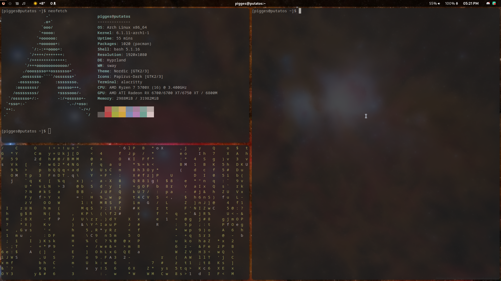

# Hyprland - Pigges

Dotfiles for my Hyprland config


## Install

### Paru
Run as user NOT ROOT!
```bash
sudo pacman -S --needed base-devel
git clone https://aur.archlinux.org/paru.git
cd paru
makepkg -si
```

### Packages
```bash
paru -S hyprland-bin polkit-gnome ffmpeg                    \
rofi pavucontrol thunar starship wl-clipboard wf-recorder   \
swaybg grimblast-git ffmpegthumbnailer tumbler playerctl    \
noise-suppression-for-voice thunar-archive-plugin alacritty \
waybar-hyprland wlogout swaylock-effects sddm-git pamixer   \
nwg-look-bin nordic-theme papirus-icon-theme dunst          \
noto-fonts noto-fonts-cjk noto-fonts-emoji noto-fonts-extra nerd-fonts-git
```

### Dotfiles
```bash
git clone https://github.com/Pigges/hyprland-pigges.git
cd hyprland-pigges
cp -r dotconfig/* ~/.config/
```

## Sources
* Official Hyprland Github - [https://github.com/hyprwm/Hyprland](https://github.com/hyprwm/Hyprland)
* Hyprland Titus - [https://github.com/ChrisTitusTech/hyprland-titus](https://github.com/ChrisTitusTech/hyprland-titus)