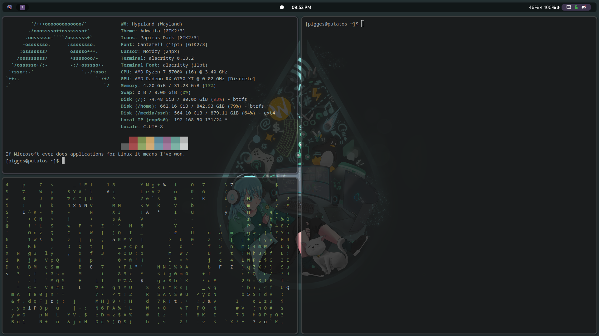

# Hyprland - Pigges

My Hyprland Config


## Install

### Paru
Run as user NOT ROOT!
```bash
sudo pacman -S --needed base-devel
git clone https://aur.archlinux.org/paru.git
cd paru
makepkg -si
```

### Packages
```bash
paru -S hyprland polkit-gnome ffmpeg                    \
rofi-lbonn-wayland-git pavucontrol nemo thunderbird starship wl-clipboard wf-recorder   \
hyprpaper hyprlock grimblast-git ffmpegthumbnailer tumbler playerctl alacritty \
waybar wlogout swaylock-effects sddm-git pamixer   \
nwg-look-bin nordic-theme papirus-icon-theme dunst          \
noto-fonts noto-fonts-cjk noto-fonts-emoji noto-fonts-extra nerd-fonts-git
```

### Dotfiles
```bash
git clone https://github.com/Pigges/hyprland-pigges.git
mv ./hyprland-pigges ~/.config/
```

## References
* Official Hyprland Github - [https://github.com/hyprwm/Hyprland](https://github.com/hyprwm/Hyprland)
