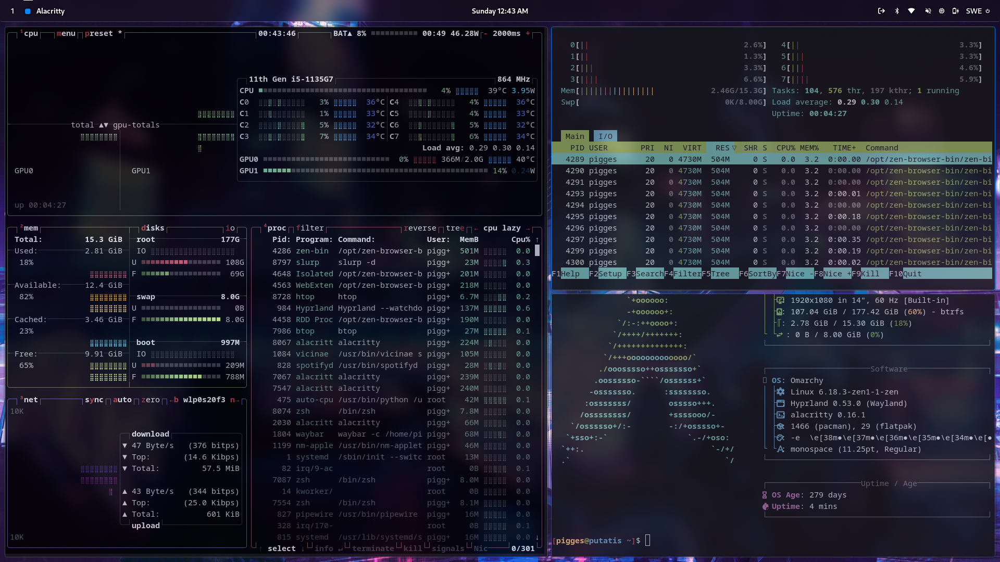

# Hyprland - Pigges

My Hyprland Config


## Install

### Paru
Run as user NOT ROOT!
```bash
sudo pacman -S --needed base-devel
git clone https://aur.archlinux.org/paru.git
cd paru
makepkg -si
```

### Packages
```bash
paru -S hyprland hyprpaper hyprpicker hypridle \
hyprlock xdg-desktop-portal-hyprland hyprpolkitagent \
ffmpeg \
pavucontrol nemo wl-clipboard \
playerctl alacritty uwsm \
waybar wlogout pamixer   \
mako vicinae \
noto-fonts noto-fonts-cjk noto-fonts-emoji noto-fonts-extra nerd-fonts-git
```

### Dotfiles
```bash
git clone https://github.com/Pigges/hyprland-pigges.git
mv ./hyprland-pigges ~/.config/
```

## References
* Official Hyprland Github - [https://github.com/hyprwm/Hyprland](https://github.com/hyprwm/Hyprland)
